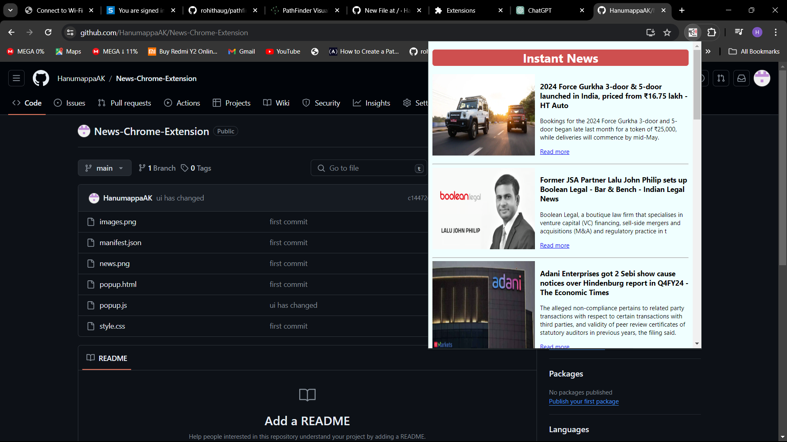

# India Business News Chrome Extension

## Overview
This Chrome extension displays the top business news headlines from India along with their images. It provides a convenient way for users to stay updated on the latest business news without having to navigate to different websites.

## Features
- Displays top business news headlines from India
- Includes images with each news article for better visual representation
- Provides easy access to stay informed about the latest business developments

## How to Use
You can use this Chrome extension without installing it from the Chrome Web Store by following these simple steps:

1. **Clone the Repository**: 
   Clone this repository to your local machine using Git. Open your terminal or command prompt and run the following command:
   https://github.com/HanumappaAK/News-Chrome-Extension.git

2. **Enable Developer Mode in Chrome**:
Open Google Chrome and go to `chrome://extensions/`.

3. **Load Unpacked**:
Enable Developer Mode by toggling the switch in the upper-right corner.
Click on the "Load unpacked" button, then select the directory where you cloned this repository.

4. **Open Extension**:
Once loaded, the extension should appear in your list of installed extensions. Click on the extension icon in the Chrome toolbar to open it.

5. **Enjoy the News**: 
You should now see the top business news headlines from India along with their images. Click on any headline to read the full article.

## Credits
This extension fetches news articles from newsapi.org, using their API.

## Support
For any issues or feature requests, please open an issue in the GitHub repository or contact the developer at hanumappa2003@gmail.com.

